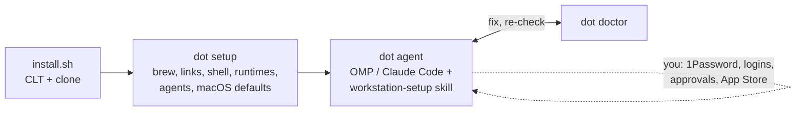

# Vít's dotfiles

An AI-first macOS setup. One script does everything that can be automated. An agent session walks you
through the rest. `dot doctor` is the acceptance test for both. It pairs with
[devbox](https://github.com/rozsival/devbox), the remote container where most agent work runs; this repo
sets up the laptop that drives it.



## New Mac

1. In Terminal:

   ```bash
   /bin/bash -c "$(curl -fsSL https://raw.githubusercontent.com/rozsival/dotfiles/main/install.sh)"
   ```

   This installs the Xcode Command Line Tools and clones this repo to `~/projects/rozsival/dotfiles`. It
   then runs `dot setup`: Homebrew and the `Brewfile`, Homebrew bash as the login shell, links, mise Node,
   rustup, OMP, Claude Code, agent skills, moshi-hook, Touch ID for sudo and macOS defaults. It asks for
   your password and, once, for the CLT dialog.

2. Open **Ghostty** (it starts the new login shell), then:

   ```bash
   cd ~/projects/rozsival/dotfiles && bin/dot agent          # or: bin/dot agent claude
   ```

   The harness starts with [`setup/PROMPT.md`](setup/PROMPT.md) and the
   [`workstation-setup`](.agents/skills/workstation-setup/SKILL.md) skill, and works through it in this
   order:

   1. 1Password
   2. Restoring secret files from 1Password
   3. devbox laptop tooling
   4. git/ssh identities
   5. GitHub
   6. Tailscale and the devbox
   7. Agent logins and Moshi
   8. App Store and apps

You do every sign-in and approval; the agent tells you what to do and checks the result.

3. You're done when `bin/dot doctor` passes.

## Everyday

| Command                                   | What it does                                                                                                                                                                                                 |
|-------------------------------------------|--------------------------------------------------------------------------------------------------------------------------------------------------------------------------------------------------------------|
| `dot doctor`                              | Checks the whole machine. Every ✗ comes with the fix.                                                                                                                                                       |
| `dot update`                              | Upgrades Homebrew, mise, OMP, Claude Code, skills and moshi-hook; clears completion caches                                                                                                                   |
| `dot link [--dry-run]`                    | Symlinks `home/` into `~`, backing up whatever it replaces                                                                                                                                                   |
| `dot brew [--mas\|--check\|--cleanup]`    | `brew bundle` for the Brewfiles; adopts hand-installed apps whose version matches. `--cleanup` only lists undeclared packages. Run it yourself: casks may ask for Touch ID unless Ghostty has App Management |
| `dot macos [--check]`                     | Applies macOS defaults, or reports drift without changing anything                                                                                                                                           |
| `dot identities [--check]`                | Renders git/ssh identity config from devbox's `identities.conf`                                                                                                                                              |
| `dot vault <status\|pull\|push> [title…]` | Syncs the secret files in `vault.list` with 1Password                                                                                                                                                        |

`dot` is on the PATH once linked (`home/.local/bin/dot` points at `bin/dot`).

## How files get onto the machine

Files land in one of four ways, each with a different owner:

| Kind     | Lives in                      | Mechanism                                                            | Examples                                                                      |
|----------|-------------------------------|----------------------------------------------------------------------|-------------------------------------------------------------------------------|
| Tracked  | `home/`                       | Symlinked by `dot link`. Editing in `~` edits the repo               | bash, shared git config, `~/.ssh/config`, Ghostty, mise                       |
| Seeded   | `seed/`                       | Copied once if absent; after that the tool owns it                   | OMP preset (rsync'd to the devbox, so it can't be a symlink), herdr           |
| Rendered | nowhere in git                | `dot identities` builds them from `~/.config/devbox/identities.conf` | `~/.gitconfig`, GitHub ssh blocks, `allowed_signers`, `*.pub`                 |
| Secret   | 1Password `Workstation` vault | `dot vault pull/push`, listed in [`vault.list`](vault.list)          | `identities.conf`, `secrets.env`, GitHub App keys, `.npmrc`, OMP `models.yml` |

No private key ever sits on disk. SSH and commit signing go through the 1Password agent, and
`~/.ssh/*.pub` only selects which key to use.

### Shell

Bash 5 from Homebrew, the same shell as the devbox.

- **[`env.sh`](home/.config/bash/env.sh)** runs in every shell, including the non-interactive ones agents
  spawn. It sets PATH (devbox launchers first, then mise shims) and runs no subprocesses.
- **[`interactive.sh`](home/.config/bash/interactive.sh)** sets history, completion and the starship
  prompt. Slow `… init` output is cached.
- **[`aliases.sh`](home/.config/bash/aliases.sh)** keeps only aliases with real use in history.

Startup budget is under 400 ms; `dot doctor` measures it. Put machine-only lines in
`~/.config/bash/local.sh`, which is untracked.

### git

Shared settings live in [`home/.config/git/config`](home/.config/git/config) (git reads the XDG path as
global). Identity, signing and the per-account `includeIf` chain live in the rendered `~/.gitconfig`,
because devbox's `doctor laptop` reads them with `git config --global`, which doesn't follow `[include]`.
Agent sessions see neither file: their launcher points `GIT_CONFIG_GLOBAL` at the devbox agent config.

### macOS defaults

[`macos/defaults.sh`](macos/defaults.sh) mirrors this Mac's settings plus security baselines: quarantine
and disk-image verification on, hibernation on, firewall on. Settings that no longer exist on macOS 26/27
were dropped (Dashboard, `airport`, Safari/Mail keys that are now sandboxed, …). SIP stays enabled;
nothing here needs it off. `dot macos --check` is read-only.

### Boundary with devbox

devbox owns `~/.config/devbox/**`, `~/.local/libexec/devbox-agent/**` and the launchers; this repo never
writes there, except restoring `identities.conf`/`secrets.env` from 1Password. This repo owns what devbox
leaves to the laptop: `~/.gitconfig`, `~/.ssh/config`, and the PATH line that puts the launchers first.

## Adding things

- **CLI or app:** add it to [`Brewfile`](Brewfile), or [`Brewfile.mas`](Brewfile.mas) for App Store apps,
  then run `dot brew`.
- **Dotfile:** put it in `home/` at its path relative to `~`, then run `dot link`.
- **macOS setting:** add a `pref` line in `macos/defaults.sh` with the value this Mac has, then run
  `dot macos --check`.
- **Secret file:** add a line to `vault.list`, then run `dot vault push <title>`.
- **Manual setup step:** add a check to `dot doctor` and a phase to the `workstation-setup` skill, so the
  next machine is guided through it.
