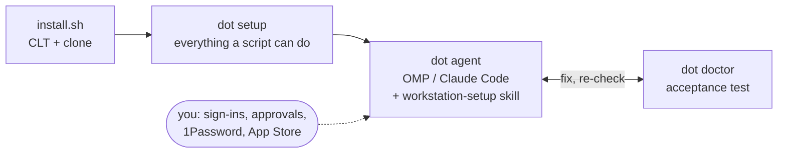

<div align="center">

# 🍏 dotfiles

### AI-first macOS setup for the laptop that drives [devbox](https://github.com/rozsival/devbox)


One script installs everything that can be automated. An agent session, **OMP** or **Claude Code** with the
`workstation-setup` skill, walks you through the rest: sign-ins, approvals and keys. **`dot doctor`** is the acceptance
test for both.

**[🚀 Quick start](#-quick-start)** · [How it works](#-how-it-works) · [Commands](#-commands) ·
[Files](#-how-files-land) · [Adding things](#-adding-things)

</div>

---

## ✨ Highlights

| Feature                  | What it gives you                                                                                            |
|--------------------------|--------------------------------------------------------------------------------------------------------------|
| **One-command install**  | `install.sh` gets git, clones the repo and runs `dot setup`: Homebrew, shell, links, runtimes, agents        |
| **Agent-guided rest**    | `dot agent` hands the manual steps to OMP or Claude Code; you click and approve, the agent verifies          |
| **Acceptance test**      | `dot doctor` checks the whole machine, and every ✗ comes with the command that fixes it                     |
| **No private keys**      | SSH and commit signing go through the 1Password agent; `~/.ssh` holds only `.pub` key selectors              |
| **Secrets in 1Password** | Credential files are kept as 1Password Documents and restored with `dot vault pull`                          |
| **Rendered identities**  | `~/.gitconfig` and per-account SSH blocks come from devbox's `identities.conf`, never from git               |
| **Drift detection**      | `dot doctor` plus read-only `--check` modes for macOS defaults, Brewfiles and identities show what has moved |

> [!IMPORTANT]
> This repo is public and holds no secrets. A file that contains a credential gets a line in [`vault.list`](vault.list)
> and lives in 1Password; git identity is rendered from devbox's registry; no private key ever touches the disk.

## 🚀 Quick start

**Requires** an Apple Silicon Mac on macOS 26+, an admin account, and the 1Password accounts that hold the SSH keys and
the `Workstation` vault.

```bash
# 1. Automated: Xcode CLT, clone to ~/projects/rozsival/dotfiles, then `dot setup`
#    (bash -c, not curl | bash: the installers it starts read the terminal)
/bin/bash -c "$(curl -fsSL https://raw.githubusercontent.com/rozsival/dotfiles/main/install.sh)"

# 2. Guided: open Ghostty (it starts the new login shell), then
cd ~/projects/rozsival/dotfiles && bin/dot agent   # or: bin/dot agent claude

# 3. Done when this passes
bin/dot doctor
```

`dot setup` asks for your password and, once, for the Xcode CLT dialog. It is idempotent, but re-running one piece
(`dot brew`, `dot link`, `dot macos`) is faster than running it all again.

> [!WARNING]
> Run anything that can prompt for sudo or Touch ID in your own terminal: `dot setup`, `dot brew`, `dot sync`,
> `dot update` and `dot macos`. An agent's shell has no TTY, so Homebrew's sudo fallback fails there and `dot`'s own
> sudo waits on a prompt no one sees.

## 🔄 How it works



**Automated** by `dot setup`: Xcode CLT → Homebrew and the [`Brewfile`](Brewfile) → Homebrew bash as the login shell →
`dot link` → mise Node and rustup → OMP, Claude Code, agent skills and moshi-hook → Touch ID for sudo → macOS defaults.

**Guided** by `dot agent`: the harness starts with [`setup/PROMPT.md`](setup/PROMPT.md) and the
[`workstation-setup`](.agents/skills/workstation-setup/SKILL.md) skill, runs `dot doctor`, and takes the failures in
phase order. It tells you exactly what to click or type, waits for you, then checks the result itself. It never reads a
secret's value.

| #  | Phase              | What happens                                                                         |
|----|--------------------|--------------------------------------------------------------------------------------|
| 1  | 1Password          | Sign in, Touch ID on, SSH agent and CLI integration on                               |
| 2  | Secret files       | `dot vault pull` restores every `vault.list` file with its mode                      |
| 3  | devbox tooling     | `devbox agent install`: `omp`/`claude` launchers, `gh` shim, `devbox-identities`     |
| 4  | git & ssh identity | `dot identities` renders `~/.gitconfig`, SSH blocks and `allowed_signers`            |
| 5  | GitHub             | `gh auth login`, SSH and signing checks, repos switched to SSH remotes               |
| 6  | Tailscale & devbox | Tailnet login, `herdr machine add devbox`, `devbox doctor laptop`                    |
| 7  | Agents & phone     | Claude Code `/login`, Moshi pairing                                                  |
| 8  | Apps               | `dot brew`, App Store apps via `dot brew --mas`, JetBrains IDEs, first-run approvals |
| 9  | Cloud & registries | `gcloud`, `az`, `glab` logins, only for what you use                                 |
| 10 | Finish             | `dot doctor` prints `✓ all checks passed`                                           |

## 🧰 Commands

`dot` is on the PATH once linked: `~/.local/bin/dot` points at `bin/dot`. Tab completes its commands, options and
`vault.list` titles.

| Command                                   | What it does                                                                                       |
|-------------------------------------------|----------------------------------------------------------------------------------------------------|
| `dot setup`                               | Everything automatable; idempotent                                                                 |
| `dot agent [omp\|claude]`                 | Starts the guided setup in an agent harness (default: OMP)                                         |
| `dot doctor`                              | Checks the whole machine and exits 1 while anything fails                                          |
| `dot sync`                                | Fast-forwards this repo from origin, then `dot link`, `dot brew` and `dot macos --check`           |
| `dot update`                              | Upgrades Homebrew, mise, OMP, Claude Code, skills and moshi-hook; clears completion caches         |
| `dot link [--dry-run]`                    | Symlinks `home/` into `~`, backing up what it replaces; copies `seed/` where absent                |
| `dot brew [--mas\|--check\|--cleanup]`    | `brew bundle` for `Brewfile` or `Brewfile.mas`; lists what is missing, or installed but undeclared |
| `dot macos [--check]`                     | Applies macOS defaults, or reports drift without changing anything                                 |
| `dot identities [--check]`                | Renders git and SSH identity config from devbox's `identities.conf`                                |
| `dot vault <status\|pull\|push> [title…]` | Syncs the files in `vault.list` with 1Password Documents                                           |

> [!TIP]
> Grant Ghostty **App Management** (System Settings → Privacy & Security). Without it macOS refuses Homebrew's changes
to
> apps it did not install, and every such cask stops for Touch ID.

## 📦 How files land

| Kind     | Lives in                      | Mechanism                                                            | Examples                                                                      |
|----------|-------------------------------|----------------------------------------------------------------------|-------------------------------------------------------------------------------|
| Tracked  | `home/`                       | Symlinked file by file by `dot link`; editing in `~` edits the repo  | bash, shared git config, `~/.ssh/config`, Ghostty, mise                       |
| Seeded   | `seed/`                       | Copied once if absent; from then on the tool owns it                 | OMP preset (rsynced to the devbox, so it can't be a symlink), herdr           |
| Rendered | nowhere in git                | `dot identities` builds them from `~/.config/devbox/identities.conf` | `~/.gitconfig`, GitHub SSH blocks, `allowed_signers`, `*.pub`                 |
| Secret   | 1Password `Workstation` vault | `dot vault pull`/`push`, listed in [`vault.list`](vault.list)        | `identities.conf`, `secrets.env`, GitHub App keys, `.npmrc`, OMP `models.yml` |

Changes travel through git. An edit to a tracked file is already in the repo: commit and push it. Another Mac
picks it up with `dot sync`, which refuses to run on uncommitted changes. `dot doctor` warns when the repo is ahead
of or behind origin. Seeded files never sync after the first copy, secrets go through `dot vault`, and `dot macos`
applies the defaults drift that `dot sync` reports.

## 🧭 Design notes

### Shell

Bash 5 from Homebrew, the same shell the devbox runs. Startup stays under 400 ms, and `dot doctor` measures it.

| File                                                 | Loaded by                                      | Role                                                                   |
|------------------------------------------------------|------------------------------------------------|------------------------------------------------------------------------|
| [`env.sh`](home/.config/bash/env.sh)                 | Every shell, including agents' non-interactive | PATH with the devbox launchers first, then mise shims; no subprocesses |
| [`interactive.sh`](home/.config/bash/interactive.sh) | Interactive shells                             | History, completion, starship prompt; slow `… init` output is cached   |
| [`aliases.sh`](home/.config/bash/aliases.sh)         | Interactive shells                             | Only the aliases that history shows are in use                         |
| `~/.config/bash/local.sh`                            | Interactive shells                             | Machine-only lines; untracked                                          |

### git

Shared settings live in [`home/.config/git/config`](home/.config/git/config), which git reads as global from the XDG
path. Identity, signing and the per-account `includeIf` chain live in the rendered `~/.gitconfig`, because devbox's
`doctor laptop` reads them with `git config --global`, which does not follow `[include]`. Agent sessions see neither:
their launcher points `GIT_CONFIG_GLOBAL` at the devbox agent config.

### macOS defaults

[`macos/defaults.sh`](macos/defaults.sh) mirrors this Mac's settings plus a security baseline: quarantine and disk-image
verification, hibernation and the firewall all on. Keys whose feature is gone in macOS 26/27 are dropped rather than
kept just in case. Everything works with SIP enabled, and `dot macos --check` is read-only.

### Boundary with devbox

devbox owns `~/.config/devbox/**`, `~/.local/libexec/devbox-agent/**` and its launchers. This repo never writes there,
except to restore `identities.conf` and `secrets.env` from 1Password. It owns what devbox leaves to the laptop:
`~/.gitconfig`, `~/.ssh/config` and the PATH line that puts the launchers first.

## 📁 Repository layout

| Path                                                   | Contents                                                                 |
|--------------------------------------------------------|--------------------------------------------------------------------------|
| [`install.sh`](install.sh)                             | Fresh-Mac entry: Xcode CLT, clone, `exec bin/dot setup`                  |
| [`bin/dot`](bin/dot)                                   | The CLI; bash 3.2, because it runs before Homebrew bash exists           |
| [`Brewfile`](Brewfile), [`Brewfile.mas`](Brewfile.mas) | Homebrew packages and casks; App Store apps                              |
| [`home/`](home)                                        | Symlinked into `~` file by file                                          |
| [`seed/`](seed)                                        | Copied into `~` only when absent                                         |
| [`macos/defaults.sh`](macos/defaults.sh)               | macOS defaults; `--check` is read-only drift detection                   |
| [`vault.list`](vault.list)                             | Secret files kept as 1Password Documents                                 |
| [`setup/PROMPT.md`](setup/PROMPT.md)                   | First message of the guided-setup session                                |
| [`.agents/skills/`](.agents/skills)                    | `workstation-setup` skill; `.claude/skills/` symlinks it for Claude Code |

## ➕ Adding things

| To add            | Do this                                                                                   |
|-------------------|-------------------------------------------------------------------------------------------|
| CLI or app        | A line in `Brewfile` (App Store: `Brewfile.mas`), then `dot brew`                         |
| Third-party tap   | Fully qualified entry with `trusted: true`, so only that formula is trusted               |
| Dotfile           | The file in `home/` at its path relative to `~`, then `dot link`                          |
| macOS setting     | A `pref` line in `macos/defaults.sh` with this Mac's value, then `dot macos --check`      |
| Secret file       | A line in `vault.list`, then `dot vault push <title>`                                     |
| Manual setup step | A `dot doctor` check with a fix hint, plus a phase entry in the `workstation-setup` skill |

Rules for agents changing this repo live in [`AGENTS.md`](AGENTS.md).

## 👤 Ownership

| Item       | Details                                                                                     |
|------------|---------------------------------------------------------------------------------------------|
| Maintainer | [@rozsival](https://github.com/rozsival)                                                    |
| Issues     | [GitHub Issues](https://github.com/rozsival/dotfiles/issues)                                |
| Companion  | [devbox](https://github.com/rozsival/devbox), the remote agent container this laptop drives |
| License    | [MIT](LICENSE-MIT.txt)                                                                      |
